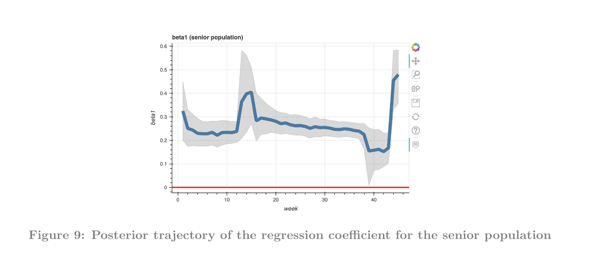

# Spatial Analysis of the underlying tendency of COVID-19 in Seoul districts

&nbsp;

### Abstract

Final project of the course "Spatio-Temporal Data Analysis" held at Yonsei university 2021 Fall semester. A statistical analysis was conducted to investigate the underlying tendency of the spread of COVID-19 among different districts in Seoul, using spatial autopoisson regression model with CAR (conditional autoregressive model).


&nbsp;


### Pre-requisite

```
  proper installation of python3

  # Data preprocessing
  import numpy as np
  import pandas as pd
  import re
  import shapefile
  import json
  
  # Data collection
  import requests as req
  from bs4 import BeautifulSoup as bs
  
  # Visualization
  import matplotlib.pyplot as plt
  import bokeh
  
  # For handling spatial Data
  from pyproj import Proj, transform
  import haversine as hs
	
  # modeling
  import pymc3 as pm
  import arviz as az
  import theano
  import scipy
```


&nbsp;


### Model Structure


&nbsp;


### Inference



